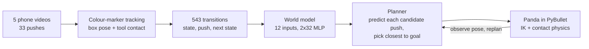

# Phone push world model

I filmed myself pushing a small box across a desk with a marked caliper. From those phone videos I extract how the box moves when it is pushed, train a small neural world model on those real examples, and use its predictions to choose pushes for a simulated Franka Panda in PyBullet. The robot executes each push through contact physics, observes where the box ended up, and replans.


_This clip is the recorded tool path replayed on the robot. The learned controller is in the [final 40 s demo](results/precision/demo/precision_demo.mp4)._

> **What this shows, and what it does not**
>
> **Shows:** 424 training transitions from my own recordings train a dynamics model that steers a simulated Panda to 23 of 24 new targets within 5 mm. The dataset contains 543 retained transitions in total; no simulator data trains the model.
>
> **Does not show:**
>
> - **Vision in the loop.** Vision extracts the training data, but during control both controllers read the box pose directly from the simulator.
> - **Beating geometry.** A hand-coded geometric controller reaches 24 of 24 and is more accurate on this task.
> - **Real-robot transfer or generalization.** One object, one surface, one camera setup, simulated physics only.

## Results

I froze the model before generating 24 new scenarios. Both controllers share the same candidate pushes, execution code, exact pose observations and a 12-push budget. Success means the box ends within 5 mm of the goal position.

| Controller          | Within 5 mm | Mean error | Median error | Mean pushes |
| ------------------- | ----------: | ---------: | -----------: | ----------: |
| Geometric baseline  |       24/24 |    2.40 mm |      2.32 mm |        4.88 |
| Learned world model |       23/24 |    5.60 mm |      3.85 mm |        7.92 |


The one failure (`precision_06`) ends 56.37 mm from its goal and stays in the average. Every case is listed in the [full report](results/precision/fresh/REPORT.md).

## How it works



1. **Collect.** Four videos, one per push direction (25 pushes), plus an 8-push pilot. Markers on the box, tool and table corners make every observation inspectable. All five videos are in [data/raw](data/raw).
2. **Extract.** Colour tracking and a per-frame table mapping give box position, yaw and tool contact point. I reject frames with missing or inconsistent markers instead of interpolating them, and keep each push entirely within one data split.
3. **Learn.** A 1,571-parameter MLP maps the box/tool state and a tool displacement to the box's next translation and rotation. Supervised regression on 424 training transitions; 61 validate.
4. **Control.** For each of 24 to 48 candidate pushes, the model predicts where the box will go. The planner picks the push predicted to land closest to the goal, the Panda executes it, and the loop repeats. The box only ever moves through physical contact.

I chose an action-conditioned state model rather than a video model, VLA or RL policy. My recordings directly give (state, action, next state) examples, and a small supervised dynamics model can learn from them without a large pretrained model or a reward loop. I picked PyBullet for its bundled Panda model, inverse kinematics and contact simulation that can be scripted from Python.

## Quick start

Python 3.11, CPU only. Verified on Windows and Linux.

**Linux (uv; macOS untested):**

```bash
uv venv -p 3.11 && source .venv/bin/activate
uv pip install -r requirements.txt   # PyBullet compiles from source here; allow a few minutes
```

**Windows (Conda, exact verified build):**

```powershell
conda create -n phone-push --file environment-win-64.lock.txt -y
conda activate phone-push
python -m pip install -r requirements-lock.txt
```

**Then three commands:**

```bash
python scripts/verify_artifacts.py            # hashes of code, model, videos and all 48 results
python -m unittest discover -s tests          # 21 checks
python scripts/evaluate_precision_frozen.py   # reruns all 48 trials (under a minute on a laptop CPU)
```

The rerun reproduces the saved trials rather than drawing a new sample. On both platforms it gives identical successes, push counts and chosen actions; final positions agree within 0.0001 mm ([Windows](results/reproduction/windows_end_to_end.json), [Linux](results/reproduction/linux_verification.json)). Rebuilding the dataset from the raw videos and retraining are covered in [docs/REPRODUCIBILITY.md](docs/REPRODUCIBILITY.md).

## What worked and what did not

**The recordings matter.** On 12 development targets, a model trained on the cleaned original videos reached 8/12. Adding the 8-push pilot recording reached 12/12, with everything else held fixed. ([Development results](docs/DEVELOPMENT_RESULTS.md)) That report also includes an earlier 22/24 result under a looser 15 mm protocol; the 5 mm evaluation above is the final one.

**Learning did not beat geometry.** The task scores position only, and straight-line translation already predicts that well. The learned model adds prediction error without a compensating benefit here. The 23/24 also belongs to the whole system (designed candidate pushes, exact state, replanning), not the network alone.

**The one failure comes from wrong predictions.** In `precision_06` all 12 pushes are 20 mm strokes. Each one was predicted to help, and six made things worse; predicted and actual endpoints differ by 6 to 16 mm. I have not yet isolated why. ([Failure analysis](docs/FAILURE_ANALYSIS.md))

**Data coverage is uneven.** My filtering removed most bottom-to-top pushes from the original videos; only one validation transition remains in that direction.

## Next experiments

1. **Close the loop through a camera.** Estimate the box pose from rendered images, handle missed detections, and rerun both controllers on estimated rather than true state.
2. **Give learning a task geometry cannot do.** Score orientation as well as position, or use an object whose response to pushes is not straight translation. That is where I would expect a learned model to help.
3. **Test generalization properly.** Hold out a whole recording session, then new surfaces, viewpoints and objects.

## Repository map

| Path       | Contents                                                                                                                                                                       |
| ---------- | ------------------------------------------------------------------------------------------------------------------------------------------------------------------------------ |
| `data/`    | Five raw videos, checksums, measurements, frozen evaluation protocols ([details](data/README.md))                                                                              |
| `scripts/` | Tracking, training, simulation, evaluation, reporting                                                                                                                          |
| `tests/`   | 21 checks of splits, geometry, units and controller behaviour                                                                                                                  |
| `results/` | Final results in `precision/fresh/` and `precision/demo/`; earlier experiments preserved ([index](results/README.md))                                                          |
| `docs/`    | [Walkthrough](docs/WALKTHROUGH.md), [reproducibility](docs/REPRODUCIBILITY.md), [failure analysis](docs/FAILURE_ANALYSIS.md), [experiment history](docs/EXPERIMENT_HISTORY.md) |

Scripts used by the frozen evaluations keep their original names and bytes, because the protocols hash them; `.gitattributes` stops Git from changing line endings and breaking those hashes.

## Assistance and authorship

I collected the recordings, designed the experiments, implemented the tracking, model, controller and evaluation pipeline, ran the experiments, and wrote the analysis. I used GitHub Copilot/Codex for implementation support, debugging suggestions, code review, documentation editing and structured analysis prompts. I also used Claude (Anthropic) to restructure and edit the README and supporting documentation, verify that the pipeline reproduces on Windows and Linux, and review the repository before publication. These tools did not collect the data, design the experiments, choose the scientific claims or replace my review. The scope of both is described in [ASSISTANCE.md](ASSISTANCE.md).

## License

Code and documentation are released under the [MIT License](LICENSE).
