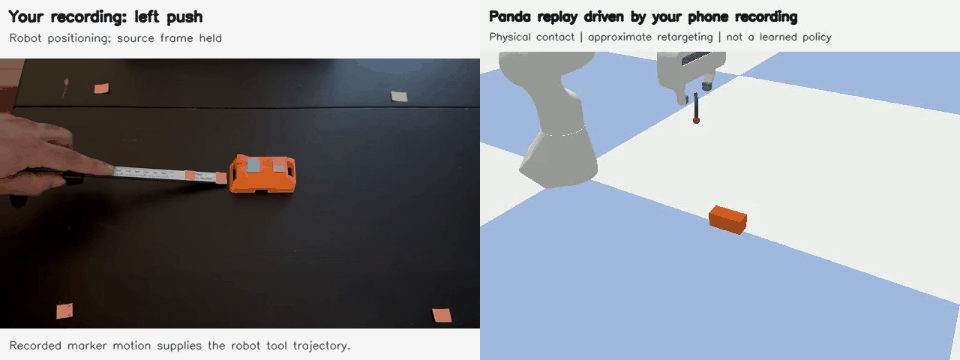
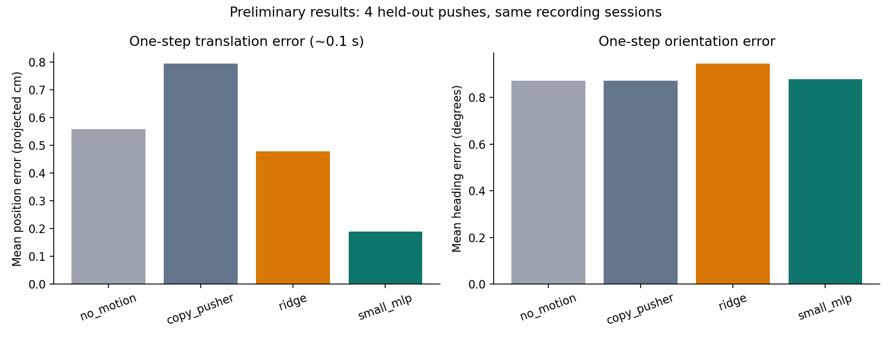
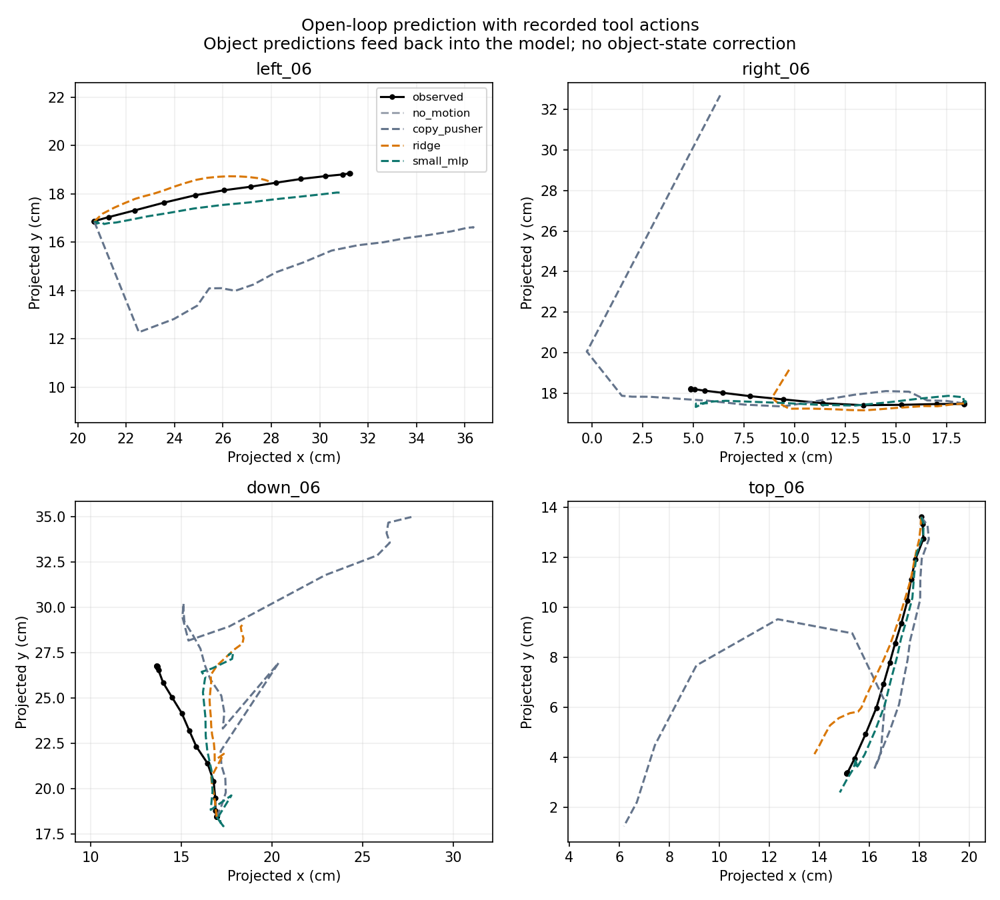

# Earlier experiments and development history

The sections below document the original pipeline and its failures, using the measurements available then. Current results are in [the README](../README.md); [original 6/12 controller details](../results/goal_control/REPORT.md) remain available.

[Failure diagnosis: all 24 pushes tested independently](../results/diagnosis/REPORT.md)

**Earlier offset experiment:** the initial 11 mm estimate (later remeasured as 9 mm) gave 7/12 targets using the original 80 x 35 x 35 mm box, but slightly worse mean final error (2.68 vs 2.62 cm). That mixed result remains intact. Revised box dimensions change some outcomes even with unchanged checkpoint weights. [Full earlier offset comparison](../results/contact_proxy/REPORT.md)

**Initial pilot review:** eight additional pushes were inspected using the remeasured 40 x 30 cm workspace and revised 9 mm offset. Before camera compensation, 515/537 reviewed frames had both marker pairs detected and 164 transitions passed initial filters. The later stabilized pipeline retains 160 pilot transitions and uses them for training. [Preserved pilot review](../results/pilot_v2/REPORT.md)



[All four replay directions, side by side with their source recordings](../results/demo/phone_to_panda.mp4)

## The experiment

A rigid orange robot cover, with no wheels, slides on a desk. Two coloured roof markers indicate its position and orientation. A digital caliper with two pink markers supplies pushes. Four table markers define a 41 x 29 cm workspace. The cover measures approximately 8 x 3.5 x 3.5 cm and the pusher markers are 4 cm apart.

Four videos contain **25 pushes**: six each from the left, right and far sides, and seven from the near side. Manual resets are excluded from the annotated review windows. Video filenames refer to the side from which the tool approaches; `down` pushes away from the camera and `top` pushes toward it.

The data has three concrete roles:

1. **State prediction:** measured tool displacements condition a model trained to predict the next object state.
2. **Simulation:** recorded tool trajectories drive Panda inverse kinematics. A tool rigidly attached 6 cm below the grasp frame contacts a dynamic object in PyBullet. The object is never moved by directly assigning its pose after initialization.
3. **Action selection:** the phone-trained dynamics model scores candidate pushes. The robot executes the chosen push, observes its new state, and replans.

## What is learned

The state is the midpoint of the two roof markers and their orientation. Features express the tool's relative position, direction and executed displacement in the object's coordinate frame, with simple interaction terms. A 1,571-parameter network with two 32-unit tanh layers predicts a translation and angle increment approximately 0.1 seconds ahead. This is a small object-state world model; it does not generate video, use language, or implement a VLA.

The dynamics model is trained by supervised regression. Action selection searches a fixed set of candidate pushes using its predictions; no reinforcement-learning policy or value function is trained.

Training uses 17 whole pushes, validation uses four, and testing uses four. Pushes 1-4, plus the seventh near-side push, train the model; push 5 from each direction validates it; push 6 tests it. **Adjacent frames never cross these splits.** All normalization comes from training data. The split yields 360 training, 73 validation and 78 test transitions. Missing marker transitions are dropped, not filled with synthetic measurements.

The network checkpoint is selected by validation error. A ridge-regression model selects its regularization on the same validation pushes. Test results have not been used to change the predictor architecture or its hyperparameters.

## Initial results

Position units below are **tabletop-projected centimetres**, not independently verified physical position errors. Roof height and tool tilt make that distinction important.

| Predictor | Test position MAE, projected cm | Test heading MAE, degrees |
|---|---:|---:|
| Assume no object motion | 0.557 | 0.873 |
| Copy tool displacement; keep orientation fixed | 0.793 | 0.873 |
| Ridge regression | 0.478 | 0.945 |
| Small neural model | **0.188** | 0.878 |

The neural model improves overall one-step position prediction. It **does not improve mean heading error** over keeping orientation fixed. During moving transitions alone, copying the tool displacement achieves 0.123 projected cm error, better than the network's 0.175. The overall advantage therefore must not be interpreted as superior prediction of every contact motion; approach and withdrawal behaviour also affect the score.

A stronger contact-aware geometric rule predicts movement only when the tool is near the object and moving inward. Its distance tolerance is selected on validation pushes. This achieves **0.204 projected cm** position MAE versus **0.188** for the neural model, substantially narrowing the gap. It is an exploratory additional baseline introduced after the original held-out results were inspected. The neural checkpoint remains unchanged. [Comparison plot](../results/contact_baseline/comparison.png)



Open-loop evaluation starts from one observed object state and then feeds predicted object states back into the model while supplying the recorded tool actions. On the four held-out pushes, the neural model's endpoint position errors are approximately 0.90, 1.04, 4.03 and 0.84 projected cm. The near-side case accumulates about **57 degrees of heading error**. This is a clear failure of longer-horizon prediction.



## Physical replay

The first training push from each direction is retargeted to Panda; these examples were chosen by a fixed episode index. Each replay uses a continuously observed portion of the recording, trims approach/withdrawal, aligns its start with an object face, and executes its path over three seconds. The lateral contact offset is bounded to the face and the source projection is approximate. This is not exact reconstruction of the original contact.

All four examples produce physical tool contact and move the object in the intended general direction. The final implementation records zero contact steps between the robot body/fingers and the object: contact is through the attached spherical tip. Directional displacement is a smoke check, **not a goal-reaching success benchmark**.

The simulated object is a solid cuboid with assumed 0.1 kg mass and 0.4 friction coefficient for replay. The real cover is hollow and its friction/mass have not been measured. Replay demonstrates a data-to-simulation pipeline, not validated physical transfer.

## Closed-loop goal reaching

At each decision, the controller evaluates 24 possible pushes: four inward directions relative to the object, three lateral offsets, and two stroke lengths. The learned controller scores predicted endpoints using the frozen phone-trained network. The geometric controller predicts simple straight translation. Both use identical IK/motor execution and **exact simulator object poses**, with eight pushes allowed to get the object centre within 1.5 cm of a target. The task scores position, not orientation.

Twelve scenarios were generated before evaluation with seed 20261005, varying initial position, yaw, goal direction and friction. No simulation transitions train the neural model; its checkpoint and controller settings were unchanged during evaluation.

| Controller | Targets reached | Mean final distance | Mean pushes |
|---|---:|---:|---:|
| Geometric | 12/12 | 1.00 cm | 3.67 |
| Learned model | 6/12 | 2.62 cm | 5.75 |

The geometric controller is stronger on this position-only task. Better offline next-step error has not produced a control advantage. Geometric bias, sparse data coverage and the difference between the real cover and simulated cuboid are plausible contributors, not experimentally isolated explanations. See [every trajectory and failure](../results/goal_control/REPORT.md).

A post-evaluation audit found that **20 of 69 executed pushes** were predicted to improve goal distance but actually worsened it. Independent executions of all 24 candidates reproduce incorrect lateral predictions. The simulated tool centre and recorded front sticker are different observation points, with mismatched relative-position coverage. Coordinate-transform checks pass, but physical calibration remains unresolved. The audit preserves the original checkpoint and benchmark. [Evidence, plots and limitations](../results/diagnosis/REPORT.md)

## Reproduce the original experiments

Tested locally on Windows with Python 3.11, CPU PyTorch and PyBullet in DIRECT mode. GPU training is unnecessary for this small model. Robot assets ship with `pybullet_data`; no separate robot download is required.

From this repository directory, create an environment and install `requirements.txt`. Then:

```powershell
# Process the original recordings when available.
python scripts/extract_tracks.py --video-dir "C:\path\to\recordings"

# The saved tracks are included, so these run without the original videos.
python scripts/train_baseline.py
python scripts/replay_panda.py --clip all --render
python scripts/goal_control.py --split evaluation
python scripts/contact_baseline.py
python scripts/diagnose_transfer.py
python -m unittest discover -s tests -v

# Optional: rebuild the side-by-side demo using the original recordings.
python scripts/make_demo.py --video-dir "C:\path\to\recordings"
```

Expected recording filenames: `left push.mp4`, `right push.mp4`, `down push.mp4`, `top push.mp4`. The manifest contains measured dimensions and manual review windows. Each tracking QA file records the original video's SHA-256 hash. Raw videos are not included in this draft; processed tracks and results are included. Thresholds currently target this fixed scene and its marker colours.

The separate contact-offset experiment preserves those original outputs:

```powershell
python scripts/train_baseline.py --representation contact_proxy
python scripts/goal_control.py --experiment contact_proxy --split evaluation
python scripts/report_contact_proxy.py
```

It extrapolates a contact proxy by 11/40 of the observed pusher-marker vector and supplies the leading sphere surface in simulation. This only approximates local projection; it does not calibrate the raised roof markers or tilted caliper. The same examples, targets and split memberships are used. No simulator transitions train either model. Its results are development comparisons because the original test recordings and simulation scenarios were already inspected.

## What worked and failed in the original experiment

- **Worked:** simple marker tracking, whole-push data splits, cheap CPU training, recorded-motion retargeting and real simulated contact. Both roof markers were detected in 1,742 of 1,746 review-window frames, and both roof/tool pairs in 1,670. These are detector coverage counts, not manually labelled accuracy.
- **Geometry limitation:** table-marker homographies remove tabletop perspective, but roof markers sit 3.5 cm above that plane and the caliper was tilted. Its known 4 cm marker spacing has a median projected length of about 2.8 cm in the near-side video. Proxy coordinates remain biased.
- **Model limitation:** only 25 pushes, one object/surface/camera setup, and four test pushes. Stronger rotation prediction and long rollouts are unresolved. The copied-tool baseline is better on moving-only translation.
- **Control limitation:** the learned closed-loop controller reaches only half the fixed evaluation targets. It uses privileged simulator state and an approximate coordinate transfer. It is weaker than the geometric controller in this benchmark. The separate replay demonstration has no feedback policy.

The next meaningful experiments are correcting or bounding geometric error, collecting a fresh evaluation session, and measuring whether those changes improve prediction and control. Preserve the current fixed results as the initial comparison; do not tune repeatedly on its evaluation cases and call them unseen tests.

