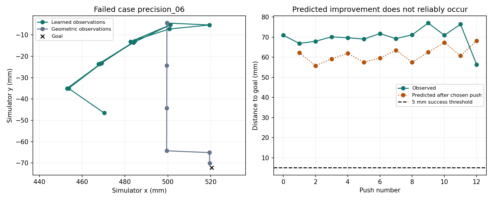

# Why the remaining trial failed

This is a post-evaluation analysis of the saved `precision_06` trial. It did not change the network, controller or evaluation outcomes.

## What the trace shows

The learned controller starts 70.96 mm from the goal and finishes 56.37 mm away after exhausting all 12 pushes. All selected strokes are 20 mm; it never enters the 20 mm fine-action region. The minimum observed goal distance is 56.37 mm. The geometric controller reaches 2.32 mm in 5 pushes under the same conditions.

All 12 selected actions are predicted to reduce goal distance, but 6 actually increase it. Predicted-versus-observed endpoint position differences range from 5.66 to 15.72 mm. The controller repeatedly chooses long pushes with inaccurate lateral motion predictions, spends its budget, and misses the target. This is not a failure of the short 2 mm stroke or a case that just falls outside the 5 mm threshold.

## Evidence for every push

All distances below are simulator measurements in millimetres. Predicted error here means distance of the predicted endpoint from the goal; model mismatch means distance between predicted and observed endpoints.

| Push | Stroke | Before | Predicted goal error | Observed goal error | Model mismatch |
|---|---:|---:|---:|---:|---:|
| 1 | 20 | 70.96 | 62.30 | 66.90 | 6.44 |
| 2 | 20 | 66.90 | 55.77 | 67.96 | 12.21 |
| 3 | 20 | 67.96 | 59.22 | 70.15 | 10.95 |
| 4 | 20 | 70.15 | 61.91 | 69.70 | 9.11 |
| 5 | 20 | 69.70 | 57.53 | 69.05 | 11.65 |
| 6 | 20 | 69.05 | 59.60 | 71.77 | 12.17 |
| 7 | 20 | 71.77 | 63.46 | 69.29 | 7.41 |
| 8 | 20 | 69.29 | 57.50 | 71.18 | 13.73 |
| 9 | 20 | 71.18 | 62.51 | 77.04 | 14.59 |
| 10 | 20 | 77.04 | 67.28 | 70.96 | 5.66 |
| 11 | 20 | 70.96 | 60.71 | 76.43 | 15.72 |
| 12 | 20 | 76.43 | 68.23 | 56.37 | 11.99 |

## What is still unknown

The trace establishes prediction mismatch and unsuccessful action selection. It does not isolate whether the mismatch comes mainly from sparse directional/contact coverage, projection bias, motion outside the training distribution, or differences between real and simulated contact. Those are hypotheses, not proven causes. An exact-state geometric controller succeeds here, so inability of this simulator configuration to reach the target is not the explanation.

A future experiment could log all candidate predictions and independently execute matched candidates, then compare errors by contact face, offset and speed. New data could target the poorly covered cases. Any fallback to geometry or uncertainty-based rejection would be a new hybrid controller and would need a newly frozen evaluation; it must not replace this failed outcome retrospectively.
