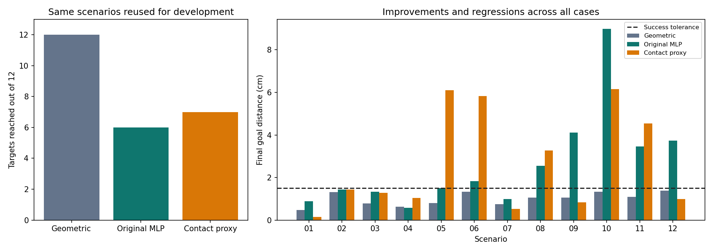

# The 11 mm contact-offset experiment

**Result: mixed.** Target success rose from 6/12 to 7/12, but mean final error increased from 2.62 to 2.68 cm. This is not evidence of a reliable overall control improvement. Simple geometry still reaches all 12 targets.

## What changed

I measured 11 mm from the front pink sticker centre to the contacting edge, and used the same edge in all four recordings. The marker separation is 40 mm. The pipeline computes an estimated contact point:

`contact = front + (11 / 40) * (front - rear)`

This extends the observed marker vector by 27.5%, approximately following its foreshortening. It does not add a fixed 1.1 projected cm. The action is the change in this estimated contact point over each transition, including changes caused by shaft rotation. Tool direction is preserved.

This is **local affine extrapolation**, not exact projective or 3-D calibration. Roof height, caliper height/tilt, the correspondence between the roof-marker midpoint and box centre, and different physical dynamics remain unresolved. In simulation, the corresponding input point is the leading surface of the 8 mm-radius sphere, rather than its centre.

## What stayed fixed

The same 511 examples and targets, train/validation/test memberships, seed, architecture, optimizer, early stopping rule, candidates, robot execution and scenario set were used. Training normalization was recomputed only from the corrected training inputs. No simulation transitions trained the network. Validation selected epoch 286 for the corrected model. The experiment was specified in `data/contact_proxy_protocol.json` before running it; no offset sweep was performed.

The original checkpoint and results remain intact. The geometric controller's rerun trajectories match its original trajectories to numerical tolerance. Both corrected-run controllers have zero robot-body/object contacts and positive attached-tool contacts in every scenario.

## Results

| Metric | Original model | Contact-proxy model |
|---|---:|---:|
| Position MAE, projected cm | 0.188 | 0.171 |
| Heading MAE, degrees | 0.878 | 1.070 |
| Moving-only position MAE, projected cm | 0.175 | 0.185 |
| Targets reached | 6/12 | 7/12 |
| Mean final goal error, cm | 2.62 | 2.68 |
| Mean pushes used | 5.75 | 5.92 |

Position prediction improves on the reused recorded test clips, while heading and moving-only translation worsen. Across long recorded-action rollouts, substantial drift persists. Physical position accuracy remains unvalidated.

These recordings and scenarios were already inspected during development. Their labels still say `test` and `evaluation` for reproducibility, but the new results are **development comparisons**, not fresh held-out evidence. One training seed and 12 scenarios are insufficient to establish a robust advantage.



| Scenario | Original error (cm) | Contact-proxy error (cm) | Contact-proxy outcome |
|---|---:|---:|---|
| eval_01 | 0.89 | 0.15 | reached |
| eval_02 | 1.43 | 1.43 | reached |
| eval_03 | 1.34 | 1.28 | reached |
| eval_04 | 0.57 | 1.05 | reached |
| eval_05 | 1.50 | 6.11 | missed |
| eval_06 | 1.82 | 5.82 | missed |
| eval_07 | 0.99 | 0.52 | reached |
| eval_08 | 2.56 | 3.27 | missed |
| eval_09 | 4.11 | 0.83 | reached |
| eval_10 | 8.98 | 6.15 | missed |
| eval_11 | 3.47 | 4.55 | missed |
| eval_12 | 3.74 | 0.98 | reached |

## Next step

Retain both experiments. Do not tune the 11 mm measurement to make this benchmark look better. First record a short pilot with a more stable camera/tool setup and varied contact positions. Inspect its projected geometry and tracking before requesting a larger dataset. Reserve a separate recording session for final evaluation after the design is frozen.

## Reproduce

```powershell
python scripts/train_baseline.py --representation contact_proxy
python scripts/goal_control.py --experiment contact_proxy --split evaluation
python scripts/report_contact_proxy.py
python -m unittest discover -s tests -v
```
