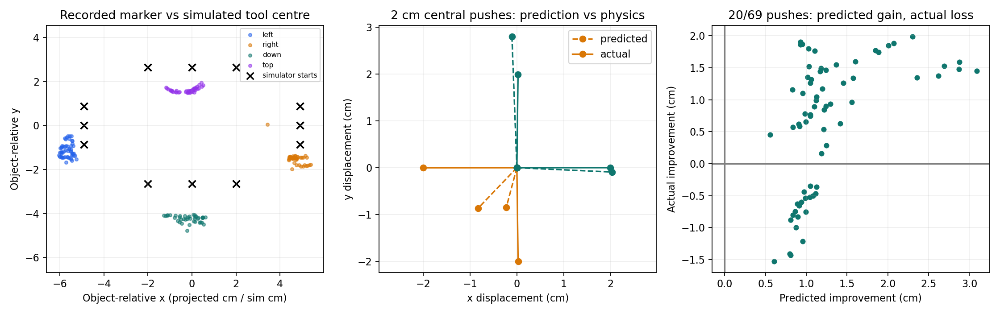

# Why the frozen phone model misses simulation targets

This audit was performed after viewing the original 12-case evaluation. It is diagnostic development work. The original model weights, control settings and benchmark results remain unchanged.

## Findings

1. The full prediction adapter passes a rigid translation/rotation consistency check (maximum position discrepancy 1.8e-16 m). Existing tests also verify table corner mapping. These checks do not establish physical camera calibration.
2. Across the original evaluation, 20 of 69 executed pushes were predicted to reduce goal distance but actually increased it.
3. In a fresh canonical scene, candidate 5 (a 2 cm leftward push with lateral offset) predicts displacement [-0.38, -1.2] cm; physics gives [-1.88, -0.29] cm. Incorrect lateral predictions can therefore cause bad action selection.
4. The recorded front sticker and simulated tool sphere centre have different meanings. Roof markers are elevated, pusher height varies, and marker-to-contact offset is unknown. Directly using those proxy coordinates as physical contact geometry is an uncalibrated transfer assumption.
5. Training contact configurations and velocities cover a narrow, direction-dependent range. The controller queries different positions and repeated 0.5 cm actions. The support plot shows this mismatch; nearest-neighbour distances in audit.json are descriptive, not calibrated confidence scores.
6. With zero commanded movement at training configurations, the network predicts a median 0.095 cm translation. It has no enforced zero-action constraint. Because velocity is not in its state, this probe alone cannot distinguish a learned bias from residual motion.

## Controlled simulation checks

All 24 candidate pushes were executed independently from the same object pose and friction. This isolates individual action prediction from repeated controller decisions. Full outcomes, training-neighbour matches and contact counts are in audit.json.

Robot-body contact occurred in 0/24 interventions; the attached tool contacted the object in 24/24.

## What this supports

The observed failure is inaccurate action-conditioned prediction under the simulation inputs. A simple global axis reversal is not supported by the coordinate checks. Marker/contact geometry mismatch and sparse configuration coverage are plausible contributors, but this audit does not isolate their individual causal effects.

The next change should make the observation/action interface consistent and constrain unsupported predictions. A measured marker-to-contact offset and a flat or calibrated pusher would support better data collection. Any contact-centred representation, geometric fallback, or additional training must be reported explicitly. Preserve the original benchmark and use a fresh final evaluation after development.

Reproduce with `python scripts/diagnose_transfer.py`. This script does not train a model or overwrite the original evaluation.
