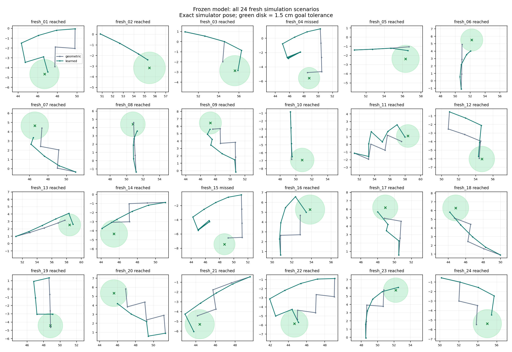
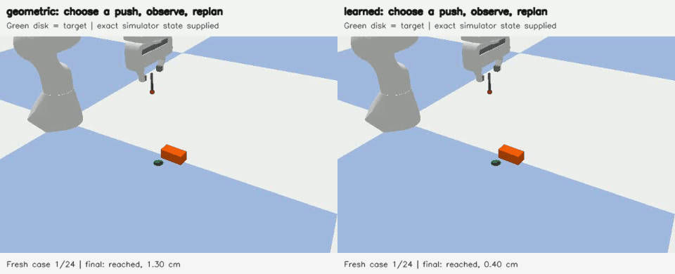

# Frozen-model evaluation on 24 new simulation scenarios

The cleaned-data-plus-pilot model was frozen after development and then evaluated once on 24 newly generated initial states, goals and friction assignments. The protocol and checkpoint/code hashes were saved before either controller ran. No outcomes from these cases selected the model or tuned thresholds.

| Controller | Targets reached | Mean final error | Mean pushes |
|---|---:|---:|---:|
| Geometric | 24/24 | 1.02 cm | 3.75 |
| Learned world model | 22/24 | 1.12 cm | 4.79 |

The frozen learned controller completes 22 of these 24 tasks. This establishes its observed performance on this small simulation sample; it does not establish superiority to the geometric controller or a population-wide success rate. Both receive exact simulator object pose. No simulator transitions were used to train the world model.

## Conditions

- Seed 824173; 24 fresh cases generated before execution.
- Object start within 1.5 cm of (0.5, 0) m; yaw within +/-0.25 radians.
- Random goal angle and distance 5.5-7.5 cm; friction 0.25/0.4/0.6, eight cases each.
- Revised object size 78.5 x 37 x 33 mm; assumed mass 0.1 kg; same solid-box approximation.
- Same 24 candidates, execution and eight-push budget; success within 1.5 cm of goal.
- All 48 runs have tool/object contact and zero robot-body/object contact.

These are fresh **simulation scenarios in the same environment family**, not fresh physical recordings, new objects, new surfaces, or vision-based robot control. The physical-video geometry remains approximate. One seed and 24 cases provide limited evidence; do not tune on them and continue calling them unseen.

## Every outcome

| Scenario | Geometric error (cm) | Learned error (cm) | Learned pushes | Learned reached? |
|---|---:|---:|---:|---|
| fresh_01 | 1.30 | 0.40 | 6 | yes |
| fresh_02 | 0.77 | 0.77 | 3 | yes |
| fresh_03 | 1.49 | 0.31 | 4 | yes |
| fresh_04 | 0.82 | 4.00 | 8 | no |
| fresh_05 | 1.37 | 0.94 | 3 | yes |
| fresh_06 | 1.44 | 1.48 | 4 | yes |
| fresh_07 | 0.81 | 1.29 | 4 | yes |
| fresh_08 | 0.23 | 0.96 | 4 | yes |
| fresh_09 | 0.89 | 0.85 | 6 | yes |
| fresh_10 | 1.32 | 1.34 | 3 | yes |
| fresh_11 | 1.10 | 0.41 | 7 | yes |
| fresh_12 | 0.33 | 0.50 | 4 | yes |
| fresh_13 | 0.91 | 0.46 | 5 | yes |
| fresh_14 | 1.28 | 1.44 | 4 | yes |
| fresh_15 | 1.01 | 3.99 | 8 | no |
| fresh_16 | 1.15 | 0.47 | 5 | yes |
| fresh_17 | 1.28 | 1.03 | 4 | yes |
| fresh_18 | 1.17 | 0.84 | 4 | yes |
| fresh_19 | 0.22 | 1.39 | 4 | yes |
| fresh_20 | 1.39 | 1.22 | 4 | yes |
| fresh_21 | 0.90 | 0.96 | 5 | yes |
| fresh_22 | 0.57 | 0.46 | 7 | yes |
| fresh_23 | 1.45 | 0.46 | 5 | yes |
| fresh_24 | 1.16 | 1.03 | 4 | yes |



## Demonstration

The optional side-by-side demo shows `fresh_01`, selected by index rather than outcome. Rendered replay must reproduce the saved physics states exactly within numerical tolerance.



## Reproduce

```powershell
python scripts/evaluate_frozen.py
python scripts/report_frozen.py --render-demo
```

The evaluator reuses the saved protocol and refuses changes to the frozen checkpoint or relevant code. Subsequent reruns reproduce this evaluation; they are not additional independent samples. The original and all intermediate development experiments remain in separate result folders.
