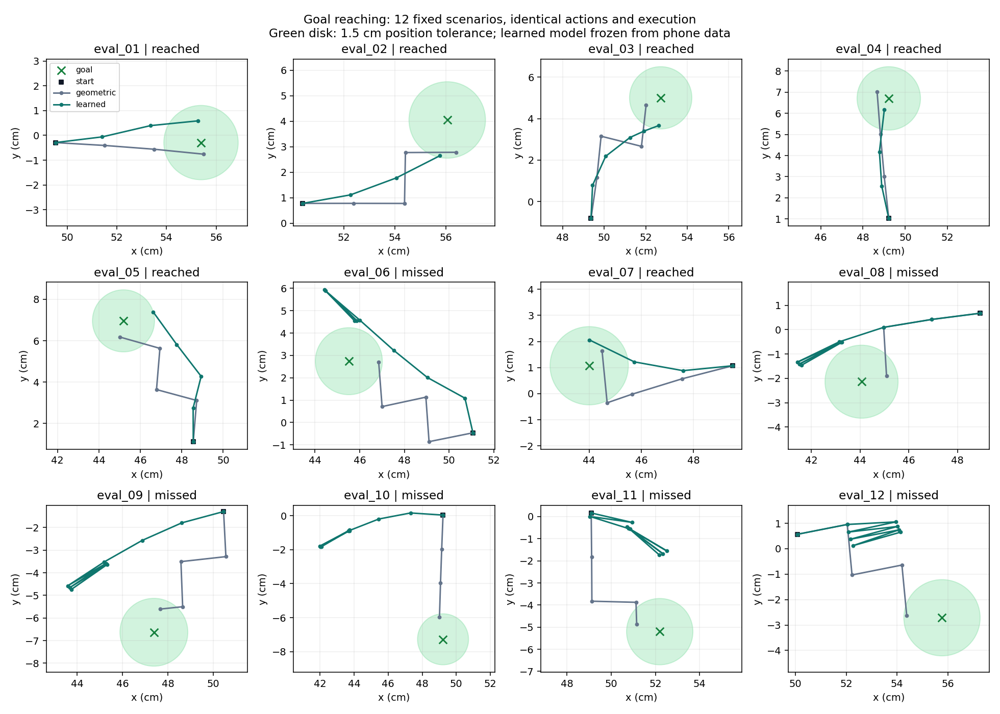

# Frozen phone-trained model in closed-loop simulation

The learned model now selects actions. At each decision it predicts the outcome of 24 candidate pushes and chooses the one whose predicted endpoint is closest to the goal. Panda executes the push through contact physics, receives a new object pose, and replans. The geometric controller uses the same candidates and execution, predicting simple straight translation.

## Fixed protocol

- 12 scenarios generated with seed 20261005 before evaluation.
- Initial object positions, yaw, target directions and friction vary.
- Success: object centre within 1.5 cm of the target within eight pushes.
- Both controllers receive exact simulator object position and yaw. This is not a vision-controlled robot benchmark.
- The neural checkpoint is unchanged from the phone-video experiment. No simulation transitions train it and evaluation outcomes did not tune its parameters or controller settings.
- The environment is a simplified cuboid on a flat plane. Its physical properties are assumptions.

| Controller | Targets reached | Mean final error | Mean pushes used |
|---|---:|---:|---:|
| Geometric | 12/12 | 1.00 cm | 3.67 |
| Learned model | 6/12 | 2.62 cm | 5.75 |

The learned model reaches some goals, but the geometric controller is more reliable on this position-only task. The offline one-step prediction improvement therefore does **not** establish a control advantage. Likely contributors include projection bias, sparse coverage of tool/object configurations, compounded prediction errors and the difference between a hollow cover and the simulated solid box. These explanations are hypotheses, not isolated experimental findings.

## All outcomes

| Scenario | Geometric error (cm) | Learned error (cm) | Learned reached goal? |
|---|---:|---:|---|
| eval_01 | 0.48 | 0.89 | Yes |
| eval_02 | 1.32 | 1.43 | Yes |
| eval_03 | 0.79 | 1.34 | Yes |
| eval_04 | 0.63 | 0.57 | Yes |
| eval_05 | 0.80 | 1.50 | Yes |
| eval_06 | 1.34 | 1.82 | No |
| eval_07 | 0.76 | 0.99 | Yes |
| eval_08 | 1.05 | 2.56 | No |
| eval_09 | 1.06 | 4.11 | No |
| eval_10 | 1.33 | 8.98 | No |
| eval_11 | 1.09 | 3.47 | No |
| eval_12 | 1.39 | 3.74 | No |



`eval_01` is the first evaluation scenario, chosen for the demo by index. It is not presented as representative of all results. All scenario JSON files include selected candidates, predictions, measured outcomes and the model-checkpoint hash.

## Reproduce

From the repository root:

```powershell
python scripts/goal_control.py --split development
python scripts/goal_control.py --split evaluation
python scripts/goal_control.py --split evaluation --case eval_01 --render
python scripts/report_control.py
```

The source evaluation protocol is `data/control_scenarios.json`. Preserve it when comparing changes. If controller/model choices are informed by these outcomes, describe later results as development results and generate a fresh final evaluation set.
