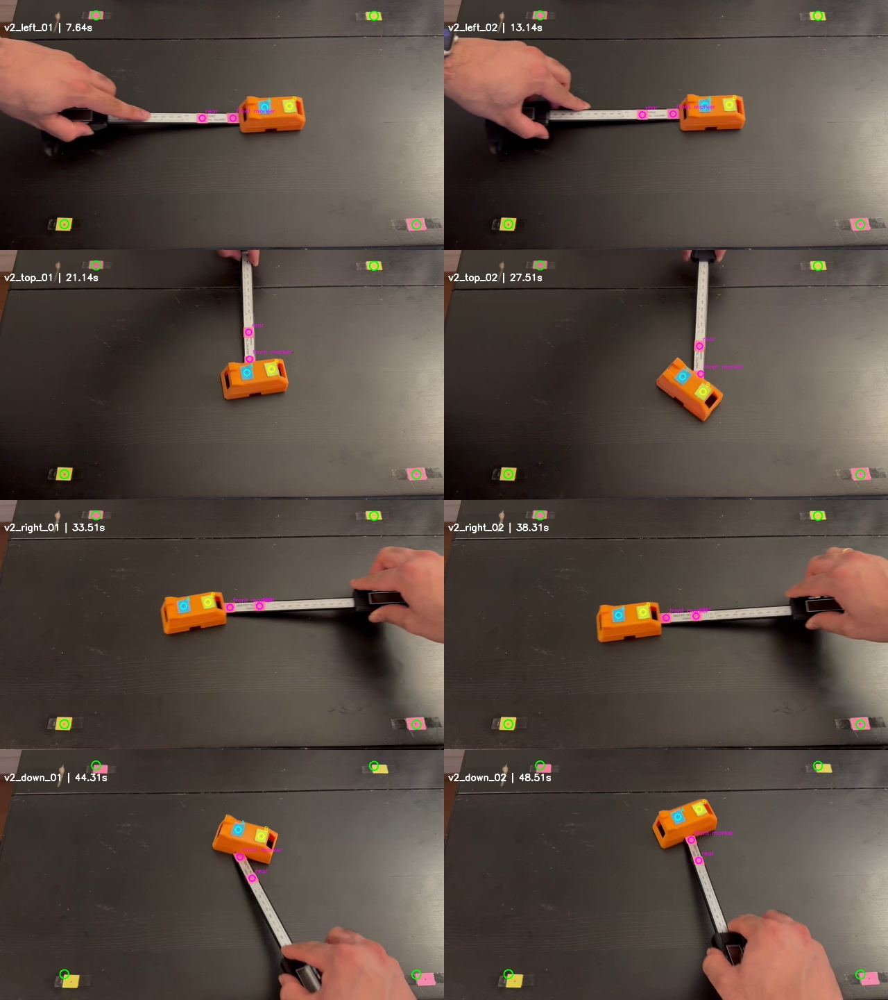
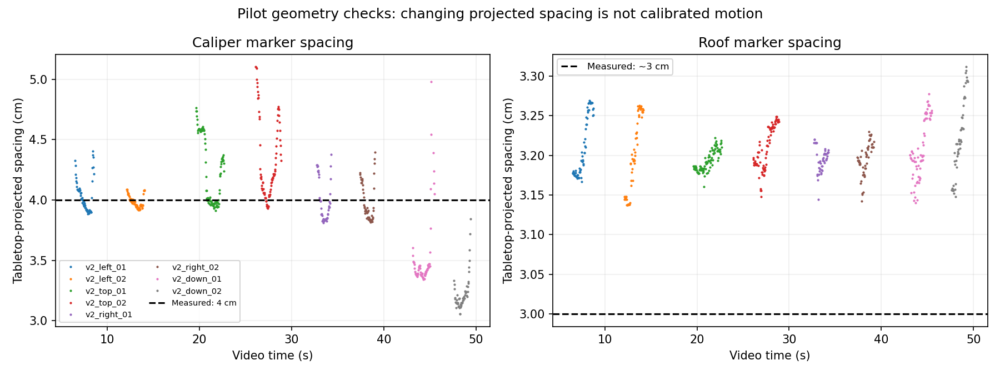

# Calibration pilot v2: recording review

The uploaded clip contains eight pushes in the observed order left, left, top, top, right, right, down, down. It is 51.65 seconds at 29.99 fps, 1024 x 576 pixels. This review uses the remeasured 40 x 30 cm workspace and the 9/40 contact-offset ratio.

Both marker pairs were detected in **515/537** reviewed frames. The existing three-frame observation/jump filters retain **164 transitions**. These are coverage counts, not proof of tracking accuracy or precise physical calibration. Resets are excluded by the saved manual windows.

Corner detection fractions: [0.836, 0.833, 0.938, 0.87]. The 95th-percentile detected corner displacements from the first frame are [2.77, 2.27, 14.41, 12.09] pixels, ordered near-left, near-right, far-right, far-left. The corner search is local (20 pixel radius); coverage must be read alongside drift.

| Push | Both pairs / frames | Caliper spacing, median cm | Roof spacing, median cm | Heading change, degrees |
|---|---:|---:|---:|---:|
| v2_left_01 | 62/69 | 4.01 | 3.19 | 1.9 |
| v2_left_02 | 59/63 | 3.98 | 3.19 | 1.3 |
| v2_top_01 | 93/93 | 4.21 | 3.19 | 28.4 |
| v2_top_02 | 83/84 | 4.20 | 3.21 | -71.2 |
| v2_right_01 | 48/48 | 3.92 | 3.20 | 12.9 |
| v2_right_02 | 50/54 | 3.92 | 3.20 | 9.7 |
| v2_down_01 | 66/72 | 3.42 | 3.20 | -51.0 |
| v2_down_02 | 54/54 | 3.19 | 3.22 | 46.2 |

## Interpretation and limits

The camera sees the entire workspace and the recording includes useful object rotation. Some pushes turn the cover substantially; that is valid manipulation data, not automatically a bad attempt. Approximate table-plane scaling remains distinct from actual 3-D geometry. The roof markers are elevated 33 mm, pusher height is not yet provided, and the roof-marker midpoint has not been confirmed as the physical cover centre. This review does not correct those effects.

The detector follows the coloured sticker centroids. The new drawn centre marks help physical measurement and visual inspection but are not independently detected. The 9 mm offset is an affine estimate along the observed caliper-marker vector, not an exact reconstruction of contact.

The pilot-specific pink detector excludes the original red-hue fallback, which incorrectly selected a reddish cover highlight as a tool marker during visual review. The initial uncorrected QA snapshots are preserved in `initial_detector/`. Detector tuning on this pilot is another reason it is development data.

This pilot is development data. No updated model performance claim follows from this review, and it must not later be called an unseen final test set. Preserve the original experiments; inspect these observations before integrating more data.

## Reproduce

`python scripts/review_pilot_v2.py --source data/raw/calibration_pilot_v2.mp4`

Windows and directions are in `data/pilot_v2_manifest.json`. Full observed tracks, source hash, geometry snapshot and coverage statistics are saved beside this report.
