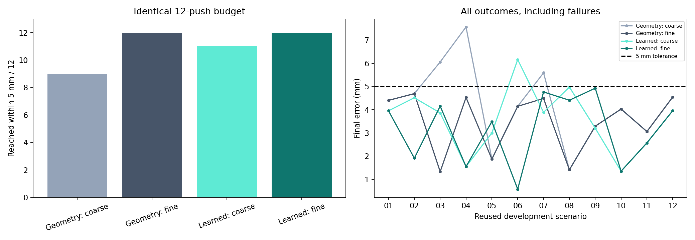

# Precision follow-up: 5 mm targets and shorter pushes

The original 1.5 cm goal tolerance intentionally allowed approximate placement. To test whether the controller could place the object more precisely, I prescribed one bounded experiment using the 12 previously inspected development scenarios. This experiment does not replace the earlier 24-case frozen evaluation.

## Fair comparison

All four conditions share a **5 mm target tolerance and 12-push budget**, the revised box dimensions, exact simulator pose, environment and execution code. The coarse set contains 10 and 20 mm strokes. The fine condition retains those and adds 2 and 5 mm strokes when within 20 mm of the target. Both geometric and learned controllers get the same candidate sets.

The trained model remains frozen. Short strokes use at least two nominal 0.1 s prediction steps, matching the existing execution's minimum 0.2 s push duration. A regression test confirms original-length predictions are unchanged and a 2 mm action is not rounded to zero prediction steps. The physical execution still includes the existing approach and settling phases; its behavior is not assumed to be an exact displacement actuator.

Thresholds and action lengths were fixed before execution; no parameter sweep followed the results. Protocol and code/model hashes are recorded in `data/precision_protocol.json`.

## Results

| Controller | Reached within 5 mm | Mean final error (mm) | Median error (mm) | Mean pushes | Fine pushes used |
|---|---:|---:|---:|---:|---:|
| Geometry: coarse | 9/12 | 4.22 | 4.27 | 6.42 | 0 |
| Geometry: fine | 12/12 | 3.48 | 4.09 | 4.67 | 4 |
| Learned: coarse | 11/12 | 3.58 | 3.87 | 7.42 | 0 |
| Learned: fine | 12/12 | 3.13 | 3.72 | 6.75 | 10 |

The fine-action geometric controller reaches 12/12 targets; the fine-action learned controller reaches 12/12. Both mean and median errors are reported because a few failures can dominate the mean. Adding finer actions alone does not guarantee accurate predictions or successful choices by the learned model.



| Scenario | Geometry coarse (mm) | Geometry fine (mm) | Learned coarse (mm) | Learned fine (mm) |
|---|---:|---:|---:|---:|
| eval_01 | 4.40 | 4.40 | 3.95 | 3.95 |
| eval_02 | 4.69 | 4.69 | 4.51 | 1.91 |
| eval_03 | 6.06 | 1.33 | 3.86 | 4.15 |
| eval_04 | 7.56 | 4.53 | 1.55 | 1.55 |
| eval_05 | 1.87 | 1.87 | 3.00 | 3.48 |
| eval_06 | 4.15 | 4.15 | 6.16 | 0.57 |
| eval_07 | 5.59 | 4.48 | 3.89 | 4.76 |
| eval_08 | 1.41 | 1.41 | 4.97 | 4.41 |
| eval_09 | 3.29 | 3.29 | 3.20 | 4.93 |
| eval_10 | 4.03 | 4.03 | 1.35 | 1.35 |
| eval_11 | 3.06 | 3.06 | 2.57 | 2.57 |
| eval_12 | 4.55 | 4.55 | 3.96 | 3.96 |

## How to interpret this

Compare coarse versus fine within this experiment to assess the added finishing actions. The earlier 1.5 cm experiment had a different budget and stopping rule, so its average errors are not directly comparable as a single-factor improvement.

All 48 runs used physical attached-tool contact and zero robot-body/object contacts. These are **simulator millimetres** with exact object observations. The phone measurements still have unresolved height/projection bias; this does not establish real-world millimetre accuracy.

The 12 cases are reused development scenarios. The original frozen 22/24 result remains valid as a record of its original protocol; this precision follow-up must not be advertised as an unseen test. Preserve the working baseline and report this limitation instead of repeatedly tuning the same cases until they pass.

## Reproduce

```powershell
python scripts/precision_experiment.py
python scripts/report_precision.py
python -m unittest discover -s tests -p test_precision.py -v
```

The evaluator checks the prescribed code/checkpoint hashes. The report also verifies that the earlier frozen evaluation's relevant code and model remain unchanged.
