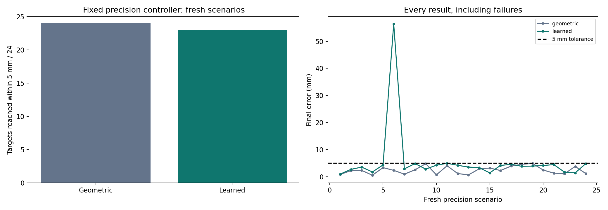

# Fresh precision evaluation: 5 mm target tolerance

After the prescribed 12-case development comparison, the fine-action controller settings were frozen. Twenty-four new scenarios were generated and saved before either controller ran (seed 637251). No model retraining, threshold tuning, or action-length sweep followed these outcomes.

| Controller | Within 5 mm | Mean final error (mm) | Median error (mm) | Mean pushes |
|---|---:|---:|---:|---:|
| Geometric + fine actions | 24/24 | 2.40 | 2.32 | 4.88 |
| Learned + fine actions | 23/24 | 5.60 | 3.85 | 7.92 |

Both use the same 5 mm tolerance, 12-push budget, exact simulator pose and revised box. Both retain 10/20 mm strokes and can choose 2/5 mm strokes within 20 mm of the target. The world-model weights are identical to the earlier 22/24, 1.5 cm-tolerance experiment. All failures remain in the averages.



## Every outcome

| Scenario | Geometric error (mm) | Learned error (mm) | Learned pushes | Learned reached? |
|---|---:|---:|---:|---|
| precision_01 | 0.84 | 0.96 | 8 | yes |
| precision_02 | 2.21 | 2.69 | 6 | yes |
| precision_03 | 2.31 | 3.52 | 9 | yes |
| precision_04 | 0.51 | 1.73 | 10 | yes |
| precision_05 | 3.33 | 4.31 | 12 | yes |
| precision_06 | 2.32 | 56.37 | 12 | no |
| precision_07 | 0.92 | 2.87 | 5 | yes |
| precision_08 | 2.53 | 4.82 | 8 | yes |
| precision_09 | 4.77 | 2.78 | 5 | yes |
| precision_10 | 0.67 | 4.23 | 8 | yes |
| precision_11 | 4.00 | 4.92 | 11 | yes |
| precision_12 | 1.14 | 4.19 | 8 | yes |
| precision_13 | 0.64 | 3.52 | 9 | yes |
| precision_14 | 2.85 | 3.34 | 6 | yes |
| precision_15 | 3.17 | 1.39 | 6 | yes |
| precision_16 | 2.26 | 4.12 | 8 | yes |
| precision_17 | 3.89 | 4.57 | 7 | yes |
| precision_18 | 4.56 | 3.81 | 4 | yes |
| precision_19 | 4.88 | 3.90 | 7 | yes |
| precision_20 | 2.45 | 4.11 | 5 | yes |
| precision_21 | 1.29 | 4.45 | 10 | yes |
| precision_22 | 1.04 | 1.67 | 8 | yes |
| precision_23 | 3.78 | 1.40 | 8 | yes |
| precision_24 | 1.13 | 4.81 | 10 | yes |

## What this means

These are simulator errors with exact observations, not real-world placement accuracy. The phone-video measurement geometry remains approximate. The cases are new but drawn from the same environment family, one object and the same parameter ranges. One small sample does not establish a general superiority claim.

The earlier 1.5 cm result uses a different stopping rule, push budget and scenario set. Do not present the difference in average errors as an isolated effect of shorter actions. The paired coarse/fine comparison in `../REPORT.md` is the relevant development ablation.

All 48 executions have attached-tool contact and zero robot-body/object contacts. Protocol, code and checkpoint hashes are verified before reporting. The original 1.5 cm evaluation is preserved. Future tuning on these results would make them development evidence for the modified controller.

## Reproduce

```powershell
python scripts/evaluate_precision_frozen.py
python scripts/report_precision_frozen.py
```

Use the saved `data/precision_frozen_protocol.json`; rerunning it reproduces the same cases, not another independent sample.
