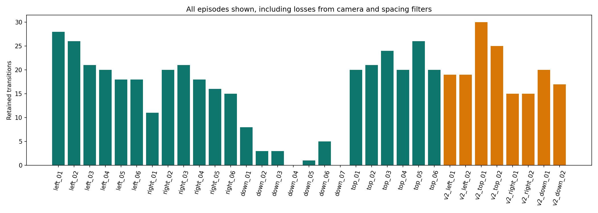
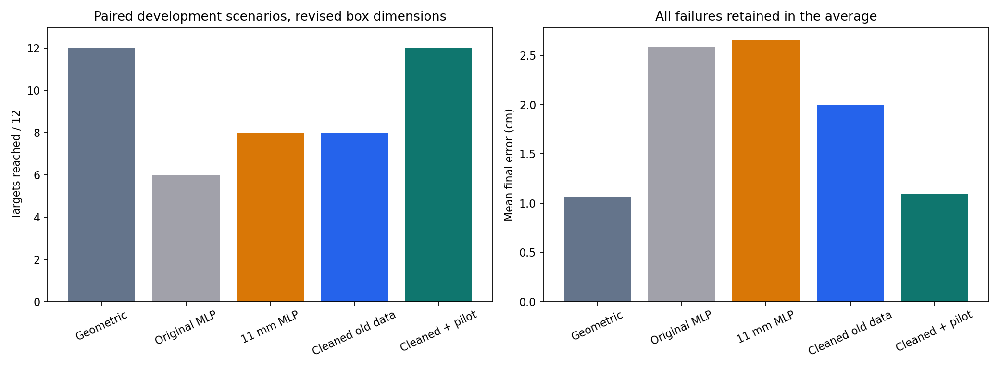
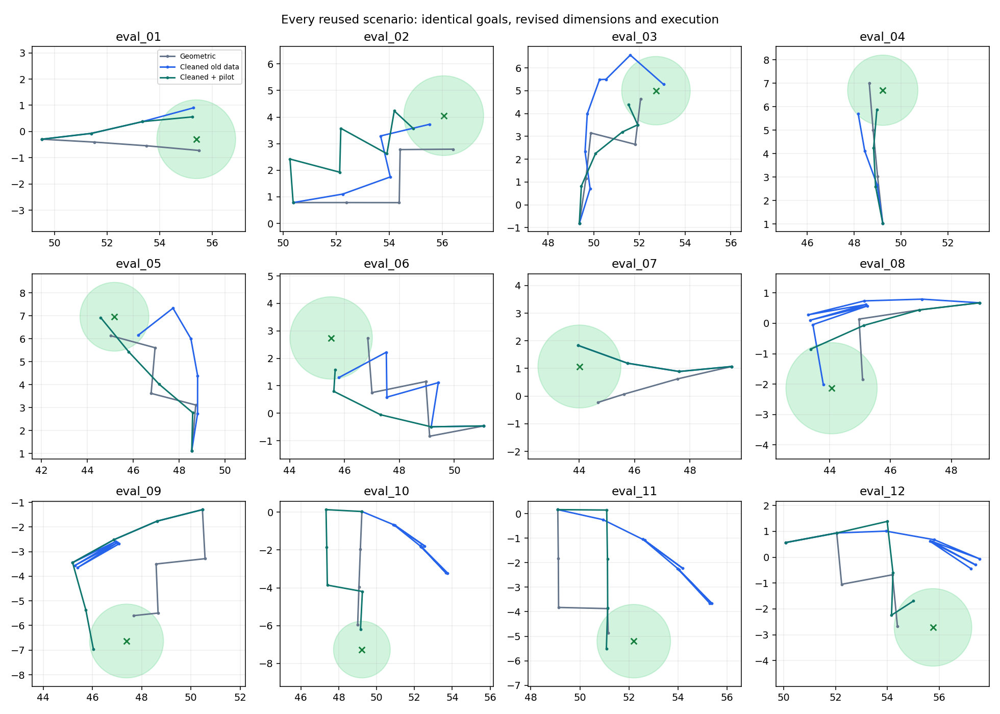

# Camera compensation, filtering and pilot-data experiment

This is development work on previously inspected recordings and reused simulation scenarios. It is not a fresh final evaluation. All historical result folders are preserved.

## Processing changes

Each frame requires four observed, uniquely associated table-corner markers. A new homography maps them to the remeasured 40 x 30 cm workspace. Missing or ambiguous corners are rejected; no coordinates or homographies are interpolated. Magenta-only tool detection avoids the cover-colour confusion found in pilot review.

Fixed, broad spacing gates retain apparent caliper spacing of 3-5 cm and roof spacing of 2.25-3.75 cm. The contact proxy extends the shaft vector by 9/40. All four frames of each training transition must pass the gates and existing jump checks. These gates reject gross inconsistency; they do not make accepted positions physically calibrated.

Applying the remeasurements to historical videos assumes marker geometry was comparable before the stickers were secured. Roof/tool heights, tool tilt and roof-marker midpoint alignment remain unresolved. This experiment does not identify each change's causal contribution separately.

## Retained observations

| Source | Reviewed frames | Accepted frames | Retained transitions |
|---|---:|---:|---:|
| left push.mp4 | 417 | 416 | 131 |
| right push.mp4 | 378 | 338 | 101 |
| down push.mp4 | 489 | 98 | 20 |
| top push.mp4 | 462 | 417 | 131 |
| calibration_pilot_v2.mp4 | 537 | 502 | 160 |

The cleaned original recordings supply **264 training, 61 validation and 58 reused-test transitions**. The pilot adds **160 training transitions**, for 424 total training examples. The pilot is not used as a held-out test. Original bottom-to-top recording coverage collapses to 20 transitions across all splits, including just one validation transition. Reported mean errors therefore underrepresent that difficult direction.



The first five seconds of the pilot show a stationary cover. Its x/y position standard deviations are [0.0069, 0.0051] projected cm with the fixed mapping and [0.0092, 0.0072] with framewise mapping. Framewise mapping adds a little detector jitter there; I do not claim it universally reduces noise. A synthetic translated-camera test verifies compensation mathematically. Four-corner fit residuals would be circular evidence of physical calibration and are not used as such.

## Training and offline comparison

Two MLPs use identical architecture, seed and optimization rules: cleaned original data alone, and the same data plus the pilot. Only training data determine normalization; the original validation episodes select stopping. Both models are evaluated on the same 58 retained original test transitions. Those clips were already inspected, so these are development checks. Scores from earlier experiments used different target coordinates and sample subsets and must not be compared as if only the model changed.

| Predictor | Position MAE, projected cm | Heading MAE, degrees | Moving-only position MAE, projected cm |
|---|---:|---:|---:|
| No movement | 0.606 | 0.826 | 1.047 |
| Copy contact | 0.748 | 0.826 | 0.118 |
| Ridge, cleaned + pilot | 0.472 | 0.981 | 0.521 |
| MLP, cleaned old data | 0.176 | 0.988 | 0.117 |
| MLP, cleaned + pilot | 0.172 | 0.926 | 0.131 |

Pilot prediction scores for the combined model are in-sample and cannot demonstrate generalization. The added pilot includes 37 bottom-to-top transitions, helping fill the coverage gap without fixing the measurement uncertainty.

## Paired robot comparison

All five controllers were rerun on the same 12 goals with the **78.5 x 37 x 33 mm** box. The candidate generator uses these revised dimensions too. Every controller has the same observations (exact simulator pose), candidate set, IK/motor execution, friction scenarios and eight-push budget. Success remains within 1.5 cm of the target centre. Original and 11 mm checkpoint weights are unchanged.

| Controller | Targets reached | Mean final error (cm) | Mean pushes |
|---|---:|---:|---:|
| Geometric | 12/12 | 1.06 | 3.58 |
| Original MLP | 6/12 | 2.59 | 5.75 |
| 11 mm MLP | 8/12 | 2.65 | 5.25 |
| Cleaned old data | 8/12 | 2.00 | 5.83 |
| Cleaned + pilot | 12/12 | 1.10 | 4.17 |

The revised box dimensions can change outcomes even for unchanged checkpoints. These results form a new paired comparison and do not replace the earlier 80 x 35 x 35 mm experiment. All 60 episodes have attached-tool contact and zero robot-body/object contacts.





## Limits and next decision

The experiment combines revised geometry, camera compensation and filtering. The old-only versus plus-pilot comparison isolates adding the pilot within that processing pipeline; it does not isolate every other change. This is one seed and a small reused scenario set. Exact simulator observations, assumed mass/friction, and a solid cuboid remain simplifications.

Judge the model by both control success and error, rather than just offline prediction or the best demonstration. Any final generalization claim needs a fresh evaluation with settings frozen beforehand. More indiscriminate filming is not the immediate remedy for unmeasured marker height or uncertain contact geometry.

## Reproduce

```powershell
python scripts/stabilize_dataset.py --video-dir data/raw
python scripts/train_stabilized.py
python scripts/control_stabilized.py
python scripts/report_stabilized.py
python -m unittest discover -s tests -v
```

The prescribed experiment is `data/stabilized_protocol.json`. Per-frame CSVs include rejection reasons; corner CSVs preserve observations; model files record the training-data hash; controller logs record checkpoint hashes. No physical mass/friction estimates or missing marker measurements were invented.
